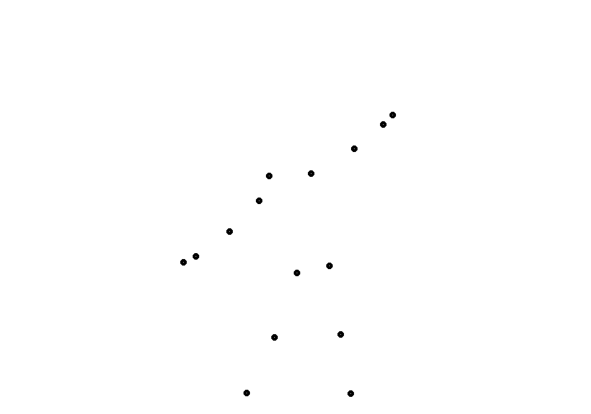

# Pose-Estimator
## Getting Started
Clone The Repository    :
```bash
   git clone https://github.com/nandwalritik/Pose-Estimator
   cd Pose-Estimator
```
### Requirements
* Python 3.7 (numpy, skimage, scipy, opencv)  
* PyTorch >= 1.6

### Training
``` bash
    python3 -m poseEst.modelLib.train
```
### Dataset
* Download [dataset](https://www.kaggle.com/nandwalritik/yoga-pose-videos-dataset) from here

### Visualization of what our model is trying to learn ?


### Note
* I am still working on it, if something doesn't works on cloning, please wait for final release !

